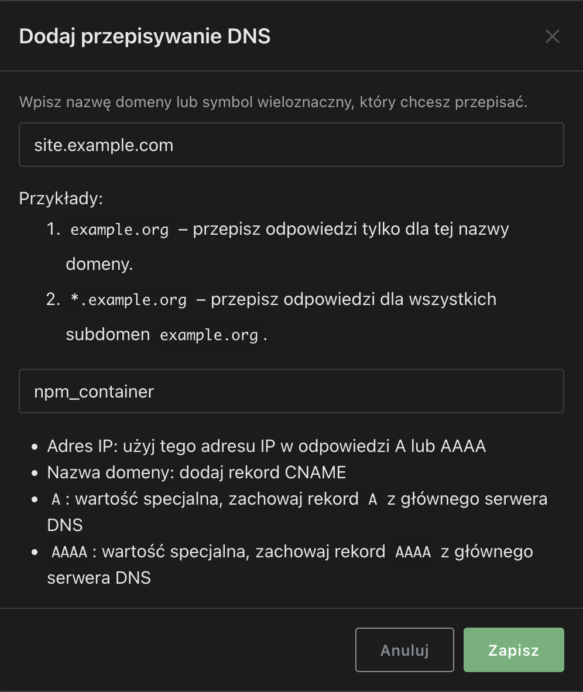
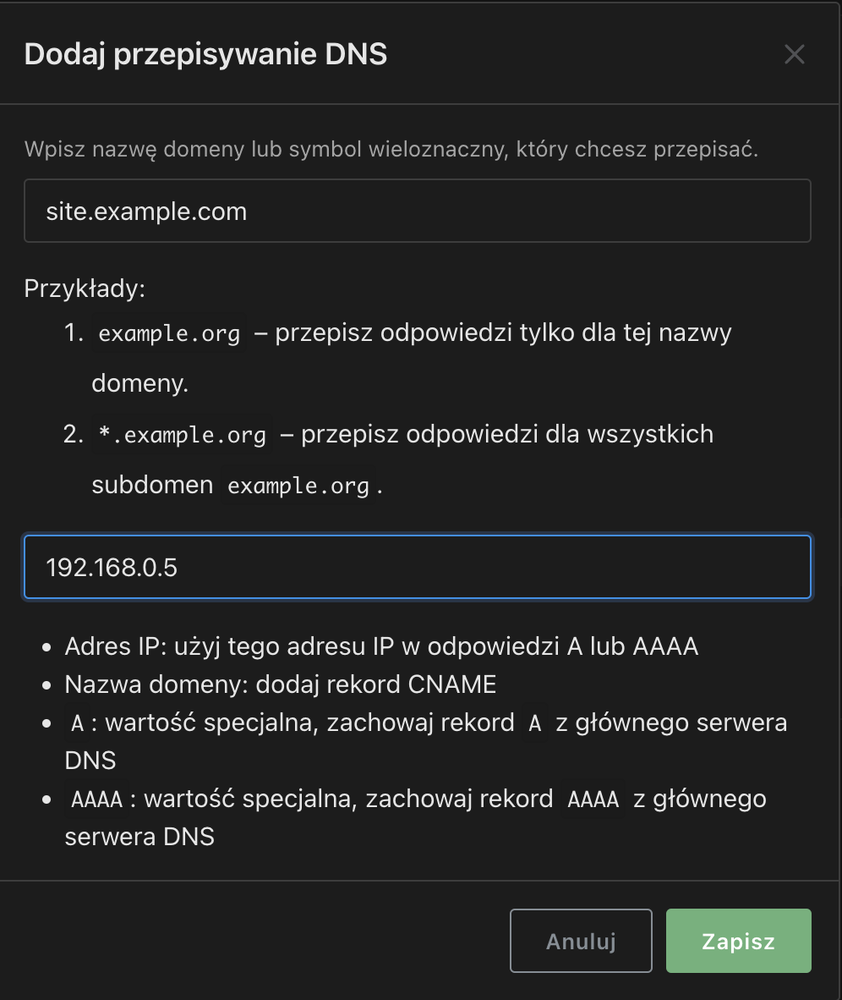

# Adguard Home
## Prerequisites
Swarm cluser with distributed filesystem like GluserFS, reverse proxy container

## Deploying
So the major problem with deploying AGH on Swarm cluster is that in "DNS rewrites" section you can't use other container name to redirect specific domain.  

So for example if you have reverse proxy hosted on the same swarm cluster (e.g. [Nginx Proxy Manager](https://nginxproxymanager.com/)) and the container name is npm_container you can't create something like that:

You have to pass IP adress like that:  

Passing IP address as a destination means that our high-availability app is now not-really-availability app. If node with IP 192.168.0.5 goes down internet in your home/business doesn't work. This is unacceptable. The easiest way is to setup two separate containers on diffrent nodes. To setup adguardhome container refer to [this site](/docker/adguardhome/deploy)

## Possible 
